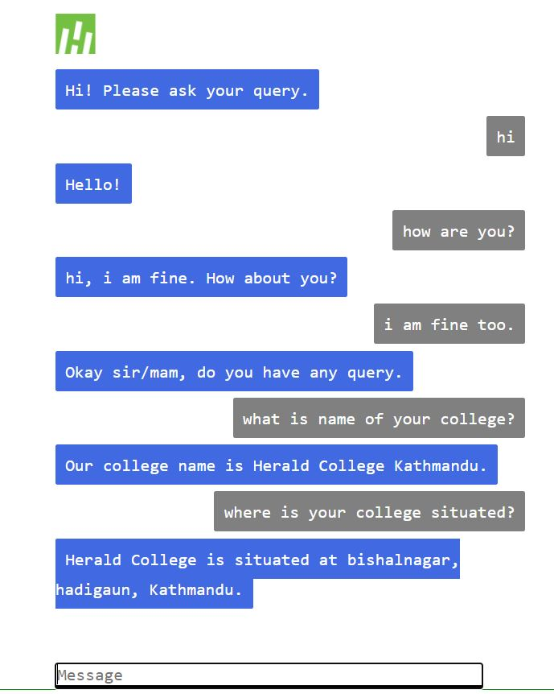

# Retrievalbasedchatbot
Retrieval Based Chatbot for the college. I have developed this demo chatbot for the Herald College Kathmandu. This chatbot can be more enhanced. We can also made it hybrid chatbot. One example of Hybrid Chatbot is :-
[https://www.youtube.com/watch?v=Z0FcYLuloWI&amp;t=11s]

The file requirement.txt include all the library name with its version. I have developed this project in the Theano backend. 

In the folder chatbot. It contains all the main files. There are two folder data and development and one configuration file. 

Data folder include demo JSON data for the herald college kathmandu. Configuration file include code to read the path of the data. 

Development folder include main files of the projects. Python file retrival_model code is related to making model for the chatbot. Python file use_model code is related to take queries from users and giving back resonses. 

I have use Flask to make the simple frontend. For connecting fronend and backend, i read this [https://dev.to/sahilrajput/build-a-chatbot-using-flask-in-5-minutes-574i] article, made similar kind of frontend and use its java script. 

Python file app is the main file of the flask. It include only the code needed in backend. 

If you want to make our own retrieval based chatbot, you have to look into retrieval_model and use_model file. You can change the dataset, train the model and use that model.
Below figure shows, the conversation sample of the project.

#python

 
