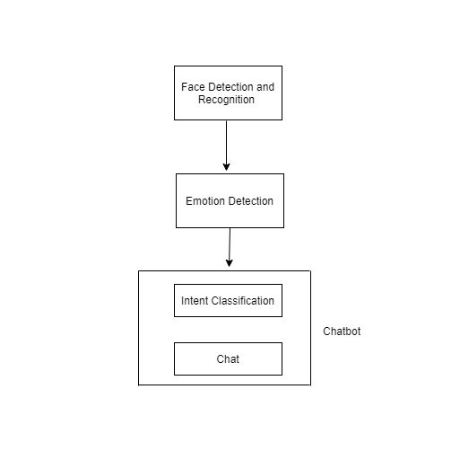

# Retrievalbasedchatbot
Emotionally Intelligent Chatbot
 Category:  Health and Urban Population Management ##mental health

Depression has become one of the major problem around the globe. Due to pandemic the problem has been growing at rapid pace. During the lockdown period in Nepal 1,647 people has committed suicide which is more than that of people killed by the pandemic here in Nepal. So, this is a serious issue which must be tackled. A simple helpline providing the emotional support can save lots of victim. A technology can also play a vital role to solve this challenging problems.  

To come up with the solution we made a “Emotionally Intelligent Chatbot” which detects emotion of the person into seven category i.e happy, sad, angry, disgust, sacred, suprised & neutral and customize chatbot accordingly. The chatbot acts in a different manner based on the emotion of the person. The emotion of the person is tracked in a certain interval of time. Based on the emotion the chatbot changes the way of interaction even during the communication with the bot.

Fig. Overall System